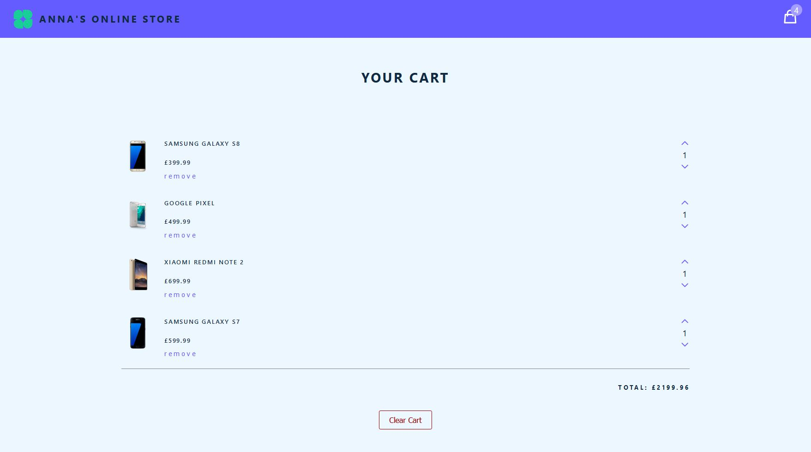

# About

An online shopping cart created using React and Redux Toolkit. 

# Screenshots

# Features

+ A Redux store which brings together the state, actions, and reducers that make up the app.

+ Async functionality with the Redux Toolkit createAsyncThunk.

+ Responsive web design approach used to create content that adjusts smoothly to various screen sizes, includes flexible layouts and images and cascading style sheet media queries.

# Technologies

+ JavaScript
+ React
+ Redux Toolkit
+ CSS

# Scripts

In the project directory, you can run:

`npm start`

Runs the app in the development mode.

Open http://localhost:3000 to view it in the browser.

The page will reload if you make edits.

# Deployment

GitHub Pages only allows a web source to be either the root or <code>/docs</code> directory, so I've used <code>/docs</code> as a build output to trigger the Github Pages build/hosting feature.
